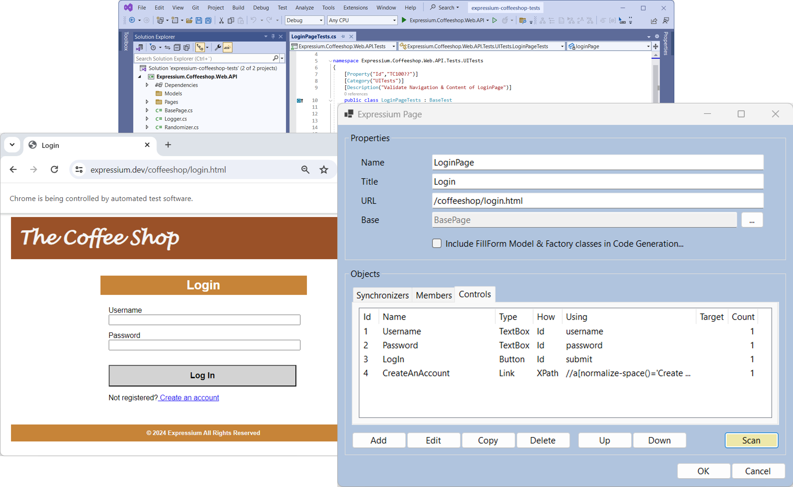

# Expressium

> Building a Selenium or Playwright test automation framework...

Expressium is an open-source software tool designed for creating and maintaining a Selenium or Playwright test automation framework.

Through intelligent enrollment of webpages and extensive code generation, Expressium provides a complete test automation framework with clean source code as a Visual Studio C# solution.

The generated output includes convenient extensions, a Page Object Model set of classes and associated UI tests targeting the web application - A solid foundation for writing business tests as traditional Keyword Driven or Behavior Driven Developing test scripts.

Once an initial test automation framework has been created the development of the solution can continue in the source code without any dependencies to the Expressium application.

Expressium will boost the establishment of a Selenium or Playwright test automation framework - Fast & Easily...
 
 

## Technologies
* Visual Studio C#
* Selenium / Playwright
* NUnit
* Log4net
* ReqnRoll
* Chrome / Edge / Firefox

## Documentation
**Web:** https://expressium.dev